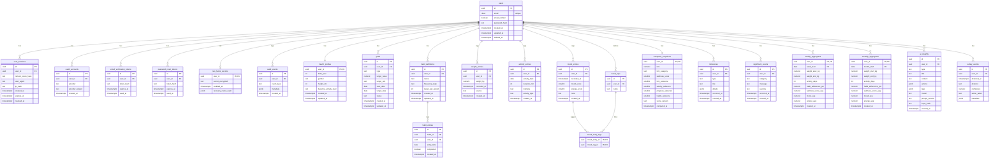

```mermaid
erDiagram
  users {
    uuid id PK
    citext email "unique"
    boolean email_verified
    text password_hash
    timestamptz created_at
    timestamptz updated_at
    timestamptz deleted_at
  }

  user_sessions {
    uuid id PK
    uuid user_id FK
    text refresh_token_hash
    text user_agent
    text ip_hash
    timestamptz created_at
    timestamptz expires_at
    timestamptz revoked_at
  }

  oauth_accounts {
    uuid id PK
    uuid user_id FK
    text provider
    text provider_subject
    timestamptz created_at
  }

  email_verification_tokens {
    uuid id PK
    uuid user_id FK
    text token_hash
    timestamptz expires_at
    timestamptz used_at
  }

  password_reset_tokens {
    uuid id PK
    uuid user_id FK
    text token_hash
    timestamptz expires_at
    timestamptz used_at
  }

  two_factor_secrets {
    uuid user_id PK,FK
    text secret_encrypted
    timestamptz enabled_at
    jsonb recovery_codes_hash
  }

  audit_events {
    uuid id PK
    uuid user_id FK
    text event_type
    jsonb metadata
    timestamptz created_at
  }

  health_profiles {
    uuid user_id PK,FK
    int birth_year
    text gender
    int height_cm
    text baseline_activity_level
    timestamptz created_at
    timestamptz updated_at
  }

  goals {
    uuid id PK
    uuid user_id FK
    text type
    numeric target_value
    text target_unit
    date start_date
    date target_date
    text status
    timestamptz created_at
    timestamptz updated_at
  }

  habit_definitions {
    uuid id PK
    uuid user_id FK
    text name
    text frequency_type
    int target_per_period
    timestamptz created_at
    timestamptz updated_at
  }

  habit_entries {
    uuid id PK
    uuid habit_id FK
    uuid user_id FK
    date entry_date
    boolean completed
    timestamptz created_at
  }

  weight_entries {
    uuid id PK
    uuid user_id FK
    numeric weight_kg
    timestamptz recorded_at
    text source
    timestamptz created_at
  }

  activity_entries {
    uuid id PK
    uuid user_id FK
    date activity_date
    int duration_min
    text intensity
    text activity_type
    timestamptz created_at
  }

  mood_entries {
    uuid id PK
    uuid user_id FK
    timestamptz recorded_at
    smallint mood_score
    smallint energy_score
    text note
    timestamptz created_at
  }

  mood_tags {
    uuid id PK
    uuid user_id FK
    text name
  }

  mood_entry_tags {
    uuid mood_entry_id PK,FK
    uuid mood_tag_id PK,FK
  }

  computed_snapshots {
    uuid user_id PK,FK
    numeric bmi
    text bmi_category
    smallint wellness_score
    smallint bmi_subscore
    smallint activity_subscore
    smallint progress_subscore
    smallint habits_subscore
    text score_version
    timestamptz computed_at
  }

  milestones {
    uuid id PK
    uuid user_id FK
    text type
    text title
    jsonb details
    timestamptz occurred_at
    timestamptz created_at
  }

  significant_events {
    uuid id PK
    uuid user_id FK
    text category
    text message
    text severity
    timestamptz occurred_at
    timestamptz created_at
  }

  weekly_aggregates {
    uuid user_id PK,FK
    date week_start PK
    numeric weight_start_kg
    numeric weight_end_kg
    int activity_days
    numeric habit_adherence_pct
    numeric wellness_score_avg
    numeric mood_avg
    numeric energy_avg
    timestamptz created_at
  }

  monthly_aggregates {
    uuid user_id PK,FK
    date month_start PK
    numeric weight_start_kg
    numeric weight_end_kg
    int activity_days
    numeric habit_adherence_pct
    numeric wellness_score_avg
    numeric mood_avg
    numeric energy_avg
    timestamptz created_at
  }

  ai_insights {
    uuid id PK
    uuid user_id FK
    text type
    text title
    text content
    jsonb actions
    jsonb tags
    text model
    text prompt_version
    text input_hash
    timestamptz created_at
  }

  safety_events {
    uuid id PK
    uuid user_id FK
    timestamptz detected_at
    text detector
    numeric confidence
    text action_taken
    jsonb metadata
  }

  users ||--o{ user_sessions : has
  users ||--o{ oauth_accounts : has
  users ||--o{ email_verification_tokens : has
  users ||--o{ password_reset_tokens : has
  users ||--o| two_factor_secrets : has
  users ||--o{ audit_events : logs
  users ||--|| health_profiles : has
  users ||--o{ goals : has
  users ||--o{ habit_definitions : has
  habit_definitions ||--o{ habit_entries : logs
  users ||--o{ weight_entries : logs
  users ||--o{ activity_entries : logs
  users ||--o{ mood_entries : logs
  users ||--o{ mood_tags : defines
  mood_entries ||--o{ mood_entry_tags : tagged
  mood_tags ||--o{ mood_entry_tags : links
  users ||--|| computed_snapshots : has
  users ||--o{ milestones : has
  users ||--o{ significant_events : has
  users ||--o{ weekly_aggregates : has
  users ||--o{ monthly_aggregates : has
  users ||--o{ ai_insights : has
  users ||--o{ safety_events : has
```